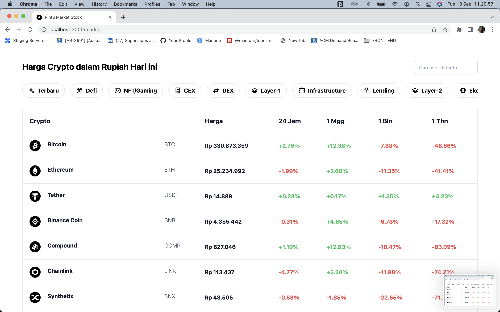

# Pintu Market Trade Page

As a User I want to be able to access menu where I can see price movement.
The price movement should be show in

- 24 Hours,
- 1 week,
- 1 month
- 1 year
  The page should show all crypto asset that available in Pintu. So that I can choose asset and decide to buy or sell.



## Data Sources

In this page, we call 2 enpoint.

1. Get all currencies
   Contain all asset crypto information, like name, symbol curencies, logo, color, and etc.

### Model Data

```js
const getAllCurrenciesData = [
  {
    currencyGroup: 'IDR',
    color: '#0A68F4',
    currencySymbol: 'Rp',
    name: 'Rupiah Token',
    logo: 'https://s3-ap-southeast-1.amazonaws.com/static.pintu.co.id/assets/images/logo/circle_IDRT.svg',
    decimal_point: 0,
    listingDate: '2020-03-11T15:13:52.000Z',
    wallets: [
      {
        currencyGroup: 'IDR',
        tokenSymbol: 'IDRT',
        decimal_point: 2,
        tokenType: 'ERC-20',
        blockchain: 'Ethereum',
        explorer: 'https://etherscan.io/tx/',
        listingDate: '2020-09-15T09:43:42.000Z',
        blockchainName: 'Ethereum',
        logo: 'https://s3.ap-southeast-1.amazonaws.com/static.pintu.co.id/assets/images/logo/blockchain/ERC-20.svg',
      },
    ],
  },
];
```

This endpoint will mapping to get name, currency symbol, and logo to show in table market.

---

2. Get all price changes
   All asset price changes will provide by this endpoint. The price changes will show in day, week, month in percentage. And the price in day. This page should be convert to IDR.

### Model data

```js
const getPriceChangesData = [
  {
    pair: 'btc/idr',
    latestPrice: '332476244',
    day: '4.18',
    week: '12.26',
    month: '-7.19',
    year: '-48.90',
  },
];
```

This endpoint will maaping to get price changes up or down.
